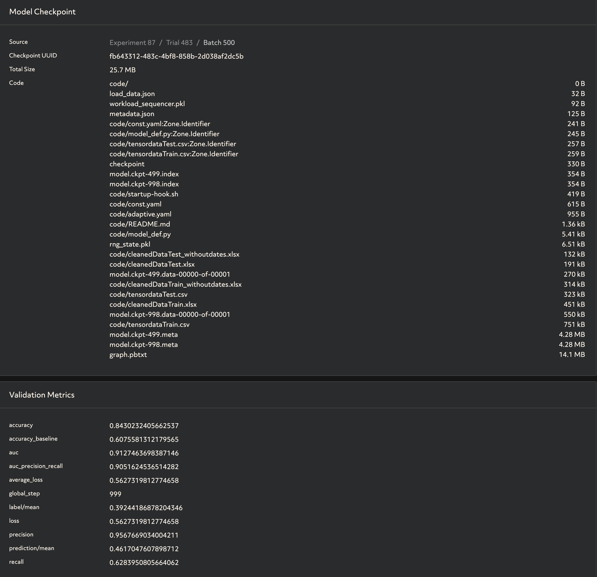

# Truck deliverly service analysis
## objective
* Builld a model that predict ontime/delay
* Identify features that influece the predication


I use the dataset provided by RAM THAIAGU. Thanks!
Dataset downloaded from Kaggle: https://www.kaggle.com/datasets/ramakrishnanthiyagu/delivery-truck-trips-data <br>
Following notebook is used as starting point for this project: https://www.kaggle.com/code/yujiyamamoto/logistics-service-analysis

## Methodology

We first started with some data exploration in the jupyter notebook<br>
After which we cleaned the data in 3 different ways.<br>
For each cleaned dataset we did an inital classification training and evaluation using the classifier of XGBBoost library <br>
We also experimented with a library call 'TPOT' which is an autoML that optimizes machine learning pipelines using genetic programming. No better results were obtained. <br> <br>

Based on the evaluation of the 3 datasets using XGBClassifier we decided on our final dataset to further train and create experiments using Determined AI's platform. <br>

## Data Sample explanation

### Before cleaning
```code
Dataset:

GpsProvider - Vendor who provides GPS<br>
BookingID - Unique Identification for a trip<br>
Market/Regular - Type of trip. Regular - Vendors with whom we will have contract. Market - Vendor with whom we will not have contract<br>
BookingID_Date - Date when booking was created<br>
vehicle_no - Truck Number<br>
Origin_Location - Trip start place<br>
Destination_Location - Trip end place<br>
Org_lat_lon - Latitude/Longitude of start place<br>
Des_lat_lon - Latitude/Longitude of end place<br>
Data_Ping_time - Time when we receive GPS ping<br>
Planned_ETA - Planned Estimated Time of Arrival<br>
Current_Location - Live location<br>
DestinationLocation - Repeat of destination location<br>
actual_eta - Time when the truck arrived<br>
Curr_lat - current latitude - changes each time when we receive GPS ping<br>
Curr_lon - current longitude - changes each time when we receive GPS ping<br>
ontime - If the truck arrived on time - calculated based on Planned and Actual ETA<br>
delay - If the truck arrived with a delay - calculated based on Planned and Actual ETA<br>
OriginLocation_Code - Origin code<br>
DestinationLocation_Code - Destination code<br>
trip_start_date - Date/Time when trip started<br>
trip_end_date Date/Time when trip ended - based on documentation (cant be considered for calculating delay)\
TRANSPORTATION_DISTANCE_IN_KM - Total KM of travel<br>
vehicleType - Type of Truck<br>
Minimum_kms_to_be_covered_in_a_day - Minimum KM the driver needs to cover in a day<br>
Driver_Name - Driver details<br>
Driver_MobileNo - Driver details<br>
customerID - Customer details<br>
customerNameCode - Customer details<br>
supplierID - Supplier - Who provides the vehicle<br>
supplierNameCode - Supplier - Who provides the vehicle<br>
Material_Shipped - Material shipped by vehicle
```

### After cleaning

```code
Market/Regular - Type of trip. Regular - Vendors with whom we will have contract. Market - Vendor with whom we will not have contract<br>
Origin_Location - Trip start place<br>
Destination_Location - Trip end place<br>
TRANSPORTATION_DISTANCE_IN_KM - Total KM of travel<br>
vehicleType - Type of Truck<br>
Driver_Name - Driver details<br>
customerID - Customer details<br>
supplierID - Supplier - Who provides the vehicle<br>
Material_Shipped - Material shipped by vehicle<br>
expected_travelhours - difference of planned ETA and start date<br>
ontime - If the truck arrived on time - calculated based on Planned and Actual ETA<br>
```

## Model Architecture

We used a decision tree model. 
We configured the first training on our dataset with adaptive ASHA
Underneath you can find our hyperparameter and configuration definition

```code
hyperparameters:
  n_trees: 200
  max_depth: 10
  learning_rate: 0.01
  l1_regularization: 0.01
  l2_regularization: 0.01
  min_node_weight: 0.1
  global_batch_size: 8
```
**hyperparameters**:<br><br>
  **n_trees**:<br>
    type: int<br>
    minval: 100<br>
    maxval: 1000<br>
  **max_depth**:<br>
    type: int<br>
    minval: 5<br>
    maxval: 20<br>
  **learning_rate**:<br>
    type: log<br>
    base: 10<br>
    minval: -4.0<br>
    maxval: -2.0<br>
  **l1_regularization**:<br>
    type: log<br>
    base: 10<br>
    minval: -4.0<br>
    maxval: -2.0<br>
  **l2_regularization**:<br>
    type: log<br>
    base: 10<br>
    minval: -4.0<br>
    maxval: -2.0<br>
  **min_node_weight**:<br>
    type: double<br>
    minval: 0.0<br>
    maxval: 0.5<br>
  **global_batch_size**: 8<br><br>
**searcher** <br><br>
  **name**: adaptive_asha<br>
  **metric**: accuracy<br>
  smaller_is_better: false<br>
  **max_length**:<br>
    batches: 500<br>
  **max_trials**: 100<br>
  
  We then further trained this model with a single searcher and best model architecture obtained from adaptive ASHA

**hyperparameters**:<br><br>
  **n_trees**: 653<br>

  **max_depth**: 11<br>

  **learning_rate**: 0.0003368435590495161<br>

  **l1_regularization**: 0.0005158795301189985<br>

  **l2_regularization**: 0.0013997404534321738<br>

  **min_node_weight**: 0.0003359855025574565<br>

  **global_batch_size**: 8<br><br> 
  
## Metrics and evaluation
  
  
  
<br> The searcher was configured to improve the accurary metric. Also loss and precision was taken into account choosing the best model.

## Reproduce results

1. Download 'checkpoints' folder and go to 'checkpoints/fb643312-483c-4bf8-858b-2d038af2dc5b/code'
2. run 'det experiment create cont.yaml .'

this training job was a fork of earlier training job adaptive with adaptive asha which code can be found under: 'checkpoints/d81ce15a-eb18-41ce-a6ad-f6c619bd7c14'